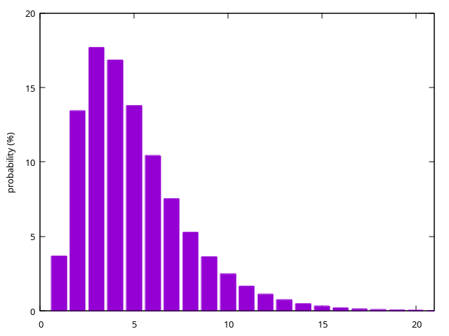

# Magic Keys Bot Competition

The API is defined in `magic-keys.h`.
A simple example bot is in `init_XPL428`, and another variation in `init_W8PRQR`.

An interactive "bot" (`init_TERM1N`) is also supplied,
which uses VT100 code sequences for better terminal output.
Recommended to use it with logging (see below).

The bash script `compile.sh` compiles the program with the specified bots:
```bash
$ ./compile.sh W8PRQR XPL428
```

The executable file plays a number of matches between two bots:
```bash
$ ./magic-keys 1000
```
The command line argument is the number of matches (100 if it is omitted).
(Note that the starting player is alternated as s/he has advantage.)

Changing the `DEBUG_LOG` define in `magic-keys.c` enables log messages.

## Probabilities
The probability of all dice falling asleep after *k* throws is shown below.
This does not take into consideration waking up the dice (either by the central position
or by throwing a fake key in the magic pond).



